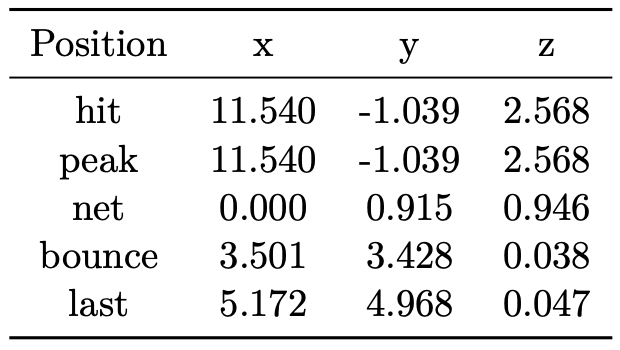
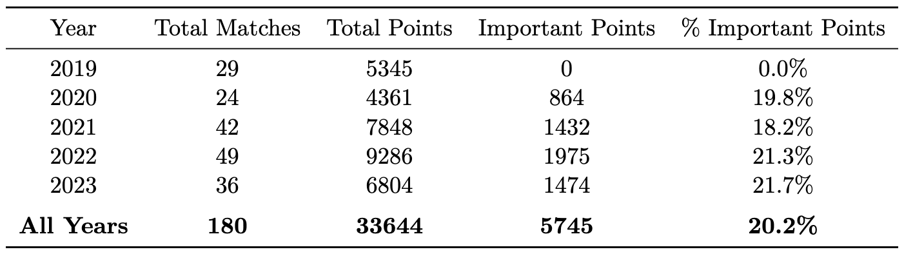
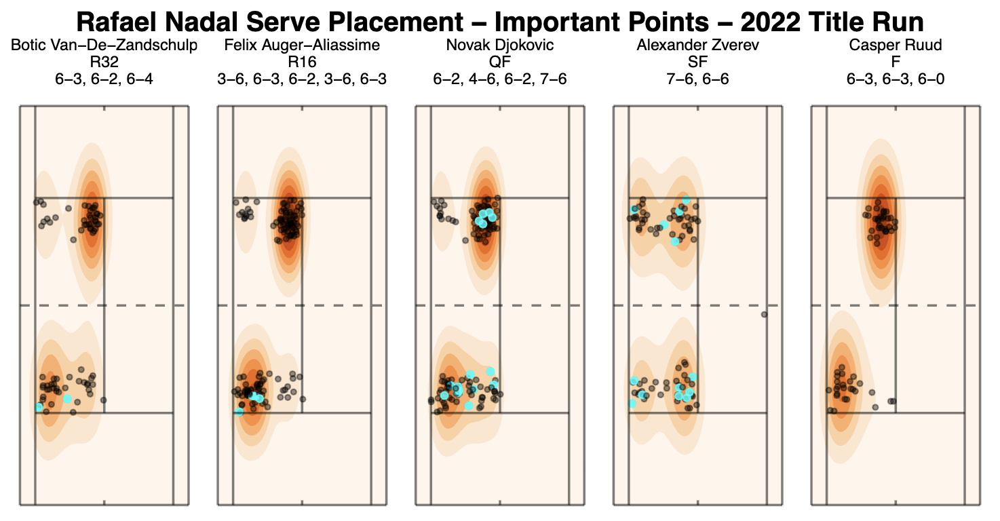
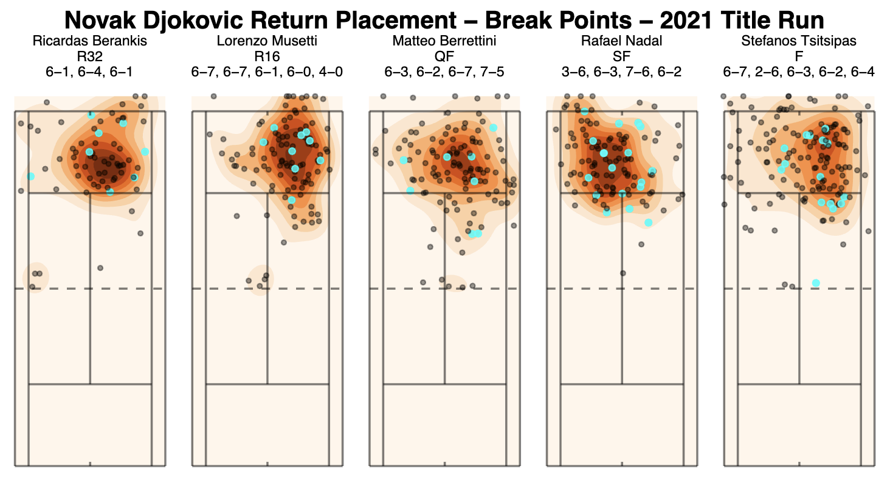
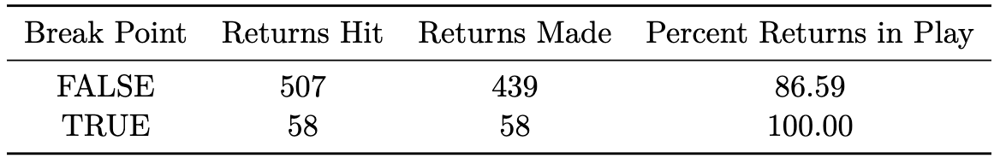

# Pressure Point Patterns: A Look Into Tennis Tactics at The French Open

The goal of this project is to move beyond simple outcome-based measures and use shot placement data -- capturing the exact coordinates of ball trajectories -- to analyze how elite players such as Federer, Nadal, and Djokovic adapt their strategies under pressure. Rather than asking whether players succeed in important moments, this project focuses on how they succeed: by examining whether they alter their serve placement, shot selection, or return tactics during critical points. Identifying these tactical shifts offers insight into the mental and strategic adjustments that underlie elite performance.

By leveraging tennis tracking technology, point importance scoring models, and visual analysis, this paper brings a data-driven perspective to a topic traditionally discussed in broad, subjective terms. In doing so, it aims to provide objective evidence of how the greatest players in tennis consistently manage to win the points that shape matches and, by extension, careers. Through careful examination of their shot patterns under pressure, this work reveals the subtle yet powerful ways that mental toughness and strategic clarity manifest themselves during the *most important* moments in tennis.

 

**`trajectoryData`**

The primary variable of interest in this project is `trajectoryData`, which includes the exact coordinates (`x`, `y`, `z`) in meters and `position` of every ball hit from the majority of stadium-court and some satellite-court matches at the French Open. The `x` coordinate represents the length of the court, the `y` coordinate represents the width of the court, the `z` coordinate represents the height of the ball above the ground, and `position` refers to the location of the ball when the coordinates are tracked.
The `trajectoryData` variable was initially stored as a JSON object. The following example shows the trajectory data of a missed serve that crossed the net and landed outside of the service box:

[{'x': 11.54, 'y': -1.039, 'z': 2.568, 'position': 'hit'},
 {'x': 11.54, 'y': -1.039, 'z': 2.568, 'position': 'peak'},
 {'x': 0.0, 'y': 0.915, 'z': 0.946, 'position': 'net'},
 {'x': 3.501, 'y': 3.428, 'z': 0.038, 'position': 'bounce'},
 {'x': 5.172, 'y': 4.968, 'z': 0.047, 'position': 'last'}]

I parsed this JSON object using the clear delimiters to obtain the cleaner format illustrated in the following table:

 

**Data Summary Statistics**

In this analysis, I focus on the years of 2020-2023 since these years have fully operational and accurate `matchScore` and `trajectoryData` variables.

 

**Serve Placement Analysis**

One of the clearest opportunities a player has to control a point is on serve. At the professional level, the serve is not just a way to start the point -- it’s a weapon and often the first step in an intentional tactical sequence. Under pressure, however, even the most elite servers must make a choice: do they lean into their strengths, or do they adapt in response to the moment?

 

Rafael Nadal’s serve placement throughout his 2022 French Open run offers a masterclass in tactical consistency under pressure. His primary strategy is clear: relentlessly target his opponent’s backhand side. Nadal largely sticks with his established patterns even on important points -- but he does so with greater precision and slightly more risk. This is most evident in his quarterfinal match against Novak Djokovic, where his serve locations on important points are clustered closer to the lines. However, against elite returners like Djokovic and Zverev -- who was known to have a more consistent and effective backhand wing with a weaker forehand (this is uncommon among top ATP players) -- Nadal's patterns show more variety. These tactical adjustments likely reflect a heightened awareness of these players' ability to anticipate and redirect familiar serves. This subtle unpredictability under pressure is a hallmark of Nadal’s tactical brilliance and of his dominance on the red clay.

 

**Return Placement Analysis**

While the serve is about initiating control in the point, the return is about reclaiming it. Unlike on serve, where we observed elite players ramping up aggression under pressure, returners tend to embrace a different strategy: one rooted in discipline and consistency.

 

Novak Djokovic's return game is legendary, and his 2021 French Open title run offers textbook examples of why. On break points -- arguably the most pressure-filled moments for a returner -- Djokovic did not miss a single return. Across 58 break point chances, he successfully put every return back into play (see the following table), applying immense pressure on his opponents to win the point outright. His returns weren’t just in -- they were placed with surgical precision, often deep and toward the backhand side. This elite depth and accuracy -- particularly under pressure -- exemplify his ability to outmaneuver opponents mentally as well as physically.

 

**Conclusions**

While only about 20% of all points in this dataset meet the threshold to be classified as important, their influence on match outcomes is undeniable. These are the moments when the mental and tactical makeup of a player is put to the test. Through this primarily visual analysis, we’ve seen how shot placement data -- particularly from serves and returns -- can illuminate the subtle ways elite players navigate pressure differently than the great players who haven't yet broken through to greatness. Pressure rarely forces a complete overhaul of strategy, but it does demand heightened mental acuity. What truly distinguishes elite champions from the game's top competitors is not just *what* they do under pressure, but *how* they execute their plan. The ability to maintain clarity, focus, and precision in the most important moments is what ultimately sets the legends apart. 

 

